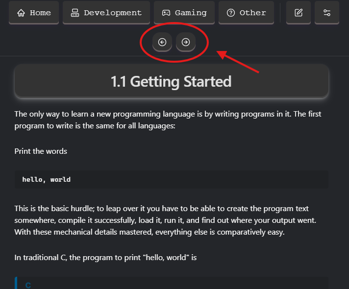
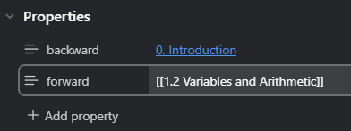

# Contributing to Codepedia

Thank you for considering contributing to Codepedia! Your help is greatly appreciated. Below are some guidelines to help you get started.

> ## Branching and Pull Requests

- **Branch**: Please use the `features` branch for all your contributions. This helps us keep the main branch stable.
- **Pull Requests**: When you are ready to submit your changes, create a pull request (PR) targeting the `features` branch. Ensure your PR includes a clear description of the changes and any relevant issue numbers.

> ## Custom CSS
Our custom CSS is located in `Codepedia\.obsidian\snippets\custom.css`. Please ensure any new styles are added here.

> ## Templates
All templates, including newly created ones, should be placed in `Codepedia\Config\Templates`.

> ## Custom Scripts
Any custom scripts should be stored in `Codepedia\Config\Scripts`.

> ## Content Contributions
We are always looking for more quality content, especially for the Development section. Please add any new development-related content to `Codepedia\Content\Development`. For other types of content, use the `Codepedia\Content\` directory.

> ## Forward/Backward Navigation

For tutorials, walkthroughs, or any note, All you have to do is specify the backward and forward note. Do this by going to the note properties, create new properties called backward and forward and set them to the note's filename for example:

**⚠️ WARNING** Use `[[note-path]]`

 The global navigation on top will show the back and forward arrows automatically when you do this.

> ## Plugins
We use numerous plugins to enhance our workflow and vault.
- Code Styler v1.1.7
  - To style codeblocks and inline code in reading/editing view
- Dataview v0.5.67
  - For advanced queries 
- Execute Code v2.0.0
  - Allows you to execute code blocks for various languages
- Git v2.30.1
  - Integrates Git with automatic backup and other features
- Hider v1.5.1
  - To hide UI elements
- Homepage v4.0.7
  - Opens the home note when you first open obsidian
- Iconize v2.14.5
  - Adds icons 
- Meta Bind v1.2.5
  - Useful for making notes interactive, adds a lot of features
- Minimal Theme v8.1.1
  - The default theme we use
- Style Settings v1.0.9
  - Offers control for adjusting various settings like css snippets, themes, and etc
- Surfing v0.9.14
  - Adds web-browser inside of obsidian
- Templater v2.9.1
  - More advanced than the obsidian templates
- Wikipedia Search v2.6.0
  - You can search, link, and open Wikipedi/Wiki articles

---
Thank you for your contributions! If you have any questions please feel free to reach out to us.
