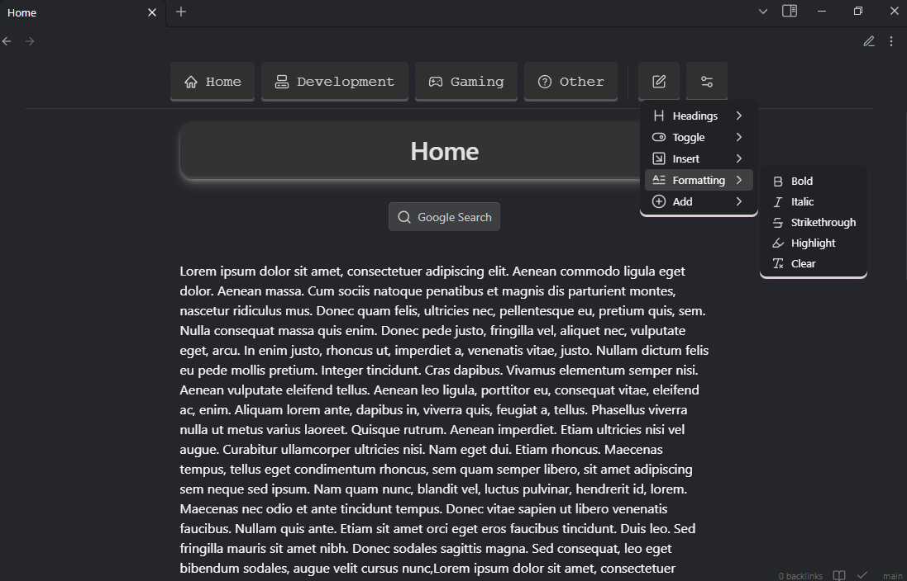
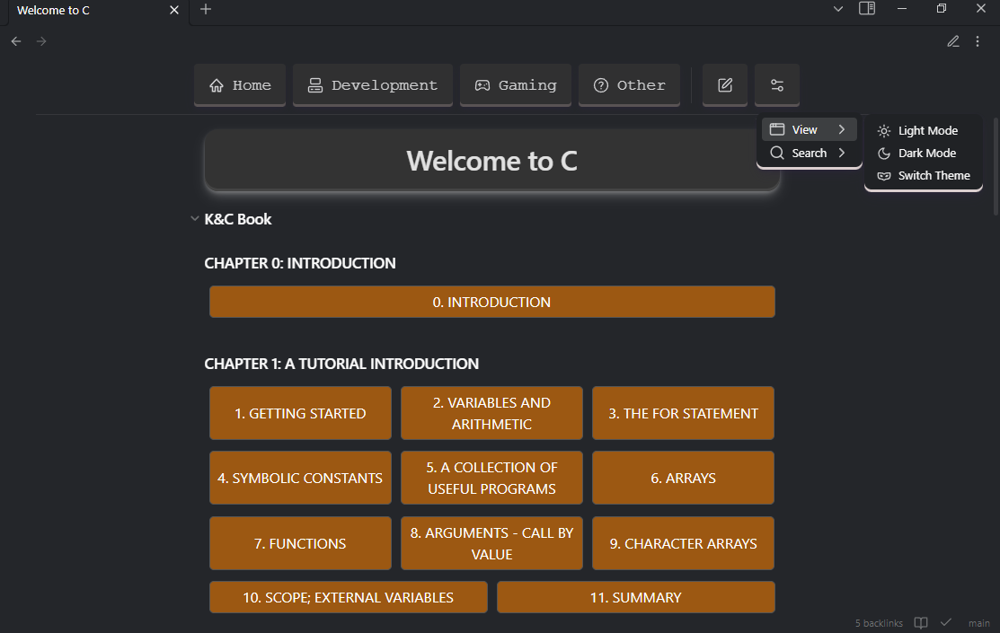
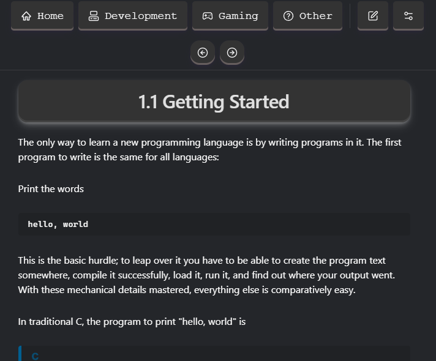

# Codepedia

Welcome to Codepedia! This project is a comprehensive collection of coding knowledge, best practices, and tutorials.

## Table of Contents

- [Introduction](#introduction)
- [Showcase](#showcase)
- [Getting Started](#getting-started)
- [Contributing](#contributing)
- [License](#license)

## Introduction

Codepedia aims to be a one-stop resource for developers of all levels to find valuable information and improve their coding skills.

## Showcase

Here are some images and videos showcasing Codepedia:




## Getting Started

To get started with Codepedia, clone the repository and explore the various sections:

```bash
git clone https://github.com/masonguinn/codepedia.git
cd codepedia
```

## Contributing

We welcome contributions from the community. Please read our [contributing guidelines](CONTRIBUTING.md) to get started.

## License

This project is licensed under the GNU GENERAL PUBLIC LICENSE. See the [LICENSE](LICENSE) file for more details.